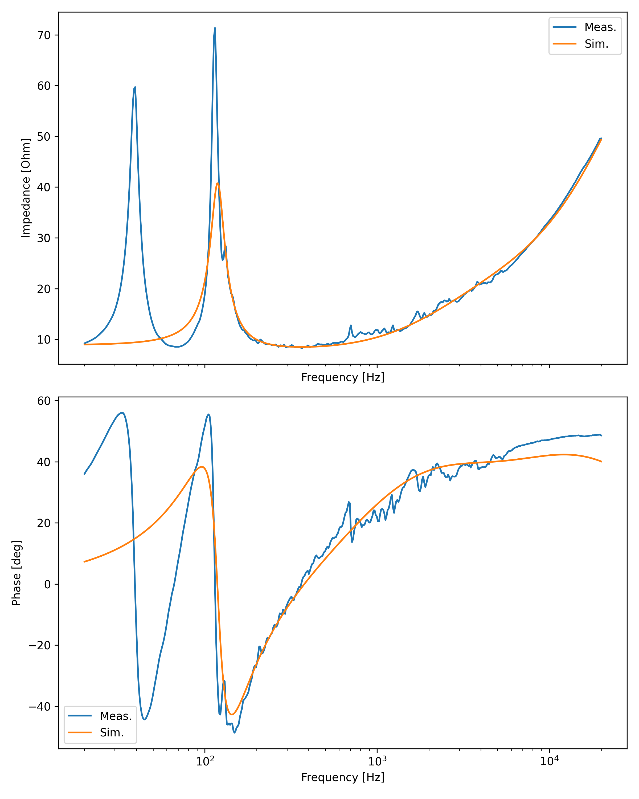
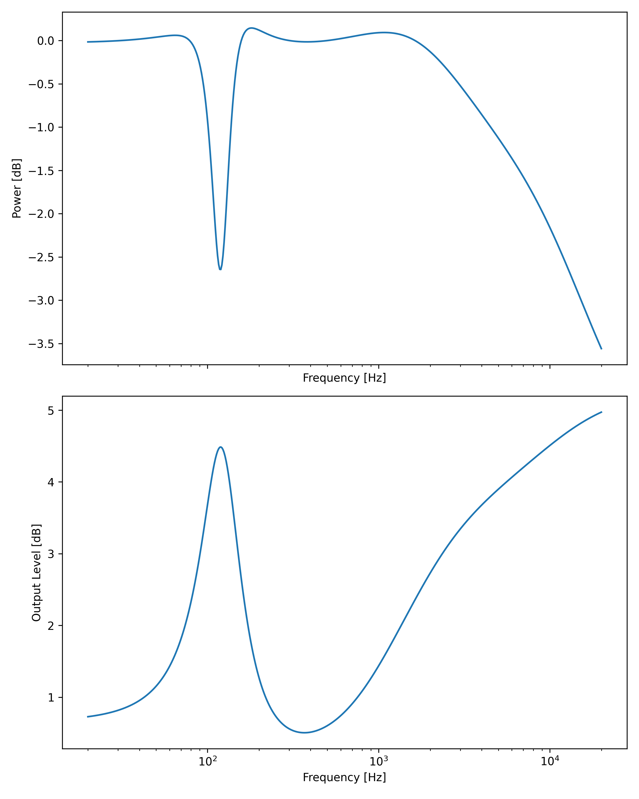
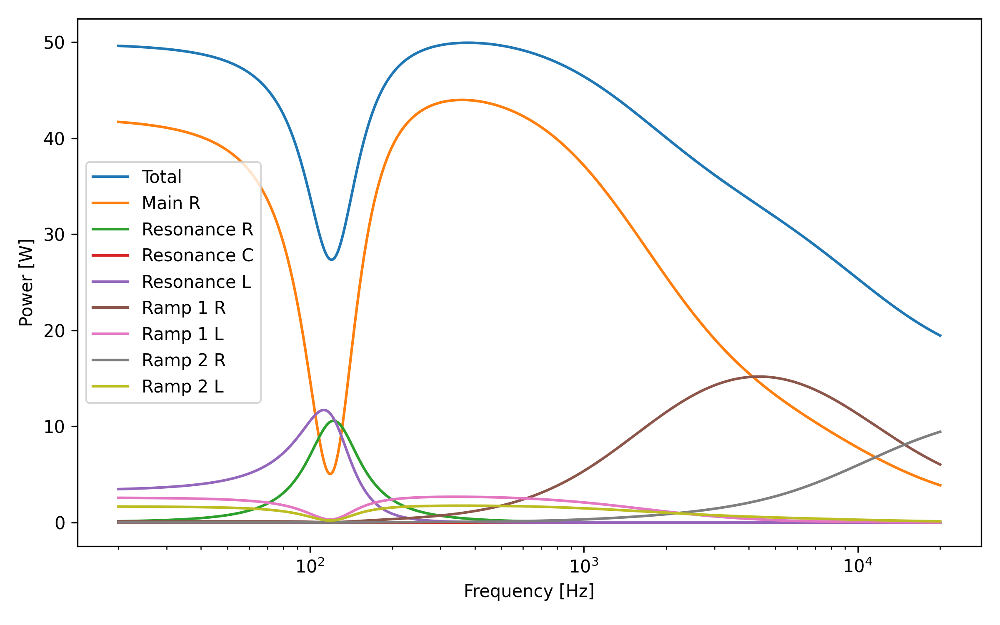

# ReactiveLoadBox

This repository contains the design of a reactive load box for guitar amplifiers. The intention is to match the impedance of a 1x12 vented guitar cabinet closely to achieve good recreation of the cabinets frequency response via impulse responses (IRs).

## Simulation

Simulation is primarily executed via Python scripts that analyze the measurement results and calculate the circuit's impedance from config values.
Based on the measured and simulated data, the input power and level to the cabinet and the circuit are calculated.

The measured and calculated impedance is shown below.

Cabinet and load input power is shown in below.

The power dissipation in each circuit component is displayed in following figure.

